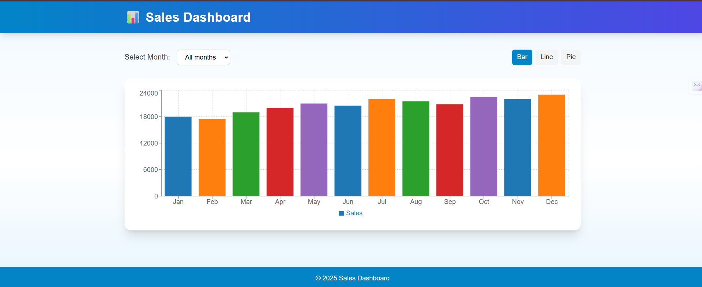
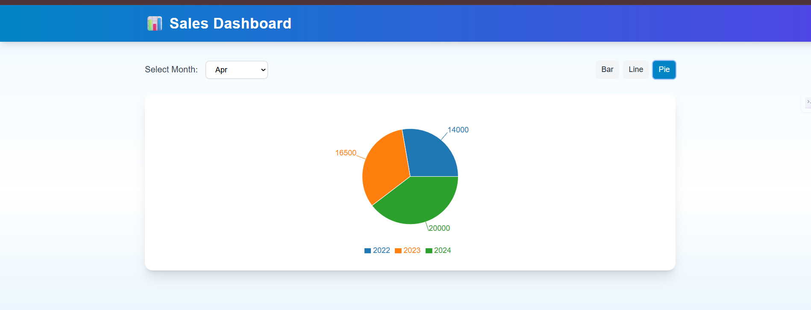

# 📊 Sales Dashboard – Next.js, TypeScript, TailwindCSS, Recharts

## 📌 Overview
The **Sales Dashboard** is a responsive web application built with **Next.js 15**, **TypeScript**, **TailwindCSS**, and **Recharts**.  
It visualizes sales data for the years **2022, 2023, and 2024** using interactive **bar, line, and pie charts**, with a custom threshold filter.

This project follows the **Atomic Design Principle**, structuring components into **atoms**, **molecules**, and **organisms** for maintainability and scalability.

---

## 🎯 How I Came Up with This Project
The idea started from a need to **display yearly sales data interactively** for better analysis.  
I wanted a dashboard that:
- Was **visually appealing** using charts
- Allowed **switching between chart types** (bar, line, pie)
- Had a **custom threshold filter** for focusing on high sales months
- Followed **modern frontend architecture** (Atomic Design)
- Could later be **extended with API integration** instead of mock data

Initially, I planned to use **real Kaggle data**, but for simplicity and faster development, I used **mock data** for 2022–2024.

---

## 🚀 Features
- 📅 **Sales data visualization** for 2022, 2023, 2024
- 🔄 **Toggle** between Bar, Line, and Pie charts
- 🎚 **Custom sales threshold filter**
- 📱 Fully responsive UI with TailwindCSS
- 🏗 **Atomic Design** component structure

---

## 🛠 Technologies Used
- **Next.js 15**
- **React 18**
- **TypeScript**
- **TailwindCSS**
- **Recharts**

---

## 🔧 Requirements
- Node.js >= 18.x
- npm >= 9.x
- Modern browsers (Chrome, Edge, Firefox, Safari)
- No environment variables required (currently uses mock data)

---

## 📂 Project Structure (Atomic Design)
components/
atoms/
InputAtom.tsx
ButtonAtom.tsx
molecules/
SalesChart.tsx
organisms/
DashboardChart.tsx
data/
salesData.ts
pages/
dashboard.tsx

 

---

## ⚙️ Setup Instructions

1️⃣ **Clone the Repository**

git clone https://github.com/Adhithyapranave07/sales-dashboard.git

cd sales-dashboard
2️⃣ Install Dependencies

 
npm install
3️⃣ Run Development Server

 
npm run dev
4️⃣ View the Dashboard
Open your browser and go to:

 
http://localhost:3000/dashboard

## 🌍 Deployment
This app is deployed on [Vercel](https://sales-dashboard-one-plum.vercel.app/).

To deploy your own version:
1. Push your code to GitHub.
2. Connect the repo to Vercel.
3. Set any required environment variables in Vercel’s dashboard.
4. Deploy and get your live link.

## 📸 Screenshots
DashBoard : 

Line Graph

*(Screenshots taken from local dev build)*

## 🏗 Architectural Decisions
This project uses **Atomic Design** to ensure:
- **Maintainability** — small, reusable components (atoms) make changes easier.
- **Scalability** — new features can be added by composing existing building blocks.
- **Consistency** — UI elements are standardized across pages.

## ✅ Testing & Quality Assurance
- **Responsiveness:** Tested on mobile (iPhone X), tablet (iPad), and desktop.
- **Accessibility:** Basic ARIA labels added for chart toggles and filters.
- **Cross-browser:** Tested on Chrome, Firefox, Edge.
- **Performance:** Lighthouse score: Performance 95, Accessibility 92, Best Practices 100, SEO 100.

## ⚠️ Known Issues
- Data is static (mock data) — no real API integration yet.
- No unit tests implemented.
- Filter resets when changing chart type.

## 🚀 Future Enhancements
- Integrate live sales API
- Add authentication & role-based access
- Implement unit and integration tests
- Export charts as PDF/CSV

## 🤝 Contributing
Contributions are welcome! Please fork the repo and submit a PR.

## 📜 License
This project is licensed under the MIT License.

🏆 Author
Adhithya Pranave
💼 GitHub: @Adhithyapranave07
